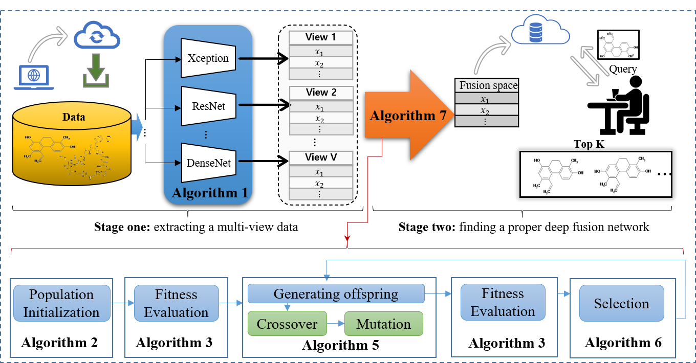

# EDF
**Description**: This package includes the python code of the EDF algorithm for multi-view fusion and its application in chemical structure recognition (close-set and open-set).
It solves the multi-view features fusion problem by searching an optimal combination scheme of different basic fusion operators.


**Requirement**: The package was developed with python3 and tensorflow-gpu(2.0.3).

**ATTN**: This package is free for academic usage. You can run it at your own risk. For other purposes, please contact Dr. Xinyan Liang.





## Data preparation
   
Download data from the following links.
   
   |Datasets  |URL |提取码 |
   |----|----|----|
   |ChemBook-10k     | https://pan.baidu.com/s/1G1P-_YyDhBTeWXhTeyOaBw  | 4fcj  |
   |ChEMBL-10k       | https://pan.baidu.com/s/1ZcPyJq8C7EEV0Trmc37U8g | 69n3 |
   |PubChem-10k      | https://pan.baidu.com/s/1ha8a119gyMul2rzT_aoUlA  | olhr |
   |tiny-imagenet200 | https://pan.baidu.com/s/1v5g9j_drRYNK9M3lOjXCqg  | tacd |
   
Take dataset "ChemBook-10k" for example,
   
   - Download "ChemBook-10k" data set;
   - Put the data set into "ChemBook-10k" folder;
   - Modify paramenter 'data_name'='ChemBook-10k' in config.py file.
  
   The structure of the folder is follows:
  
     |--------------EDF<br/>
         &nbsp;&nbsp;&nbsp;|---ChemBook-10k<br/>
            &nbsp;&nbsp;&nbsp;&nbsp;&nbsp;&nbsp;|---view<br/>
         &nbsp;&nbsp;&nbsp;|---ChEMBL-10k<br/>
            &nbsp;&nbsp;&nbsp;&nbsp;&nbsp;&nbsp;|---view<br/>
         &nbsp;&nbsp;&nbsp;|---PubChem-10k<br/>
            &nbsp;&nbsp;&nbsp;&nbsp;&nbsp;&nbsp;|---view<br/>
   
  
## Reproduce our results on ChemBook-10k, ChEMBL-10k and PubChem-10k
Before running train_EDF.py, you have to set some parameters in config.py file.
```python
def get_configs():
    paras = {
        'data_name': 'ChemBook',
        'fusion_ways': ['add', 'mul', 'cat', 'max', 'avg'],
        'fused_nb_feats': 128,
        'nb_view': 5,
        'pop_size': 28,
        'nb_iters': 20,
        'idx_split': 1,
        # training parameter settings
        'result_save_dir': 'EDF-True' + '-128-5' + 'result-1',
        'gpu_list': [0, 1, 2, 3, 4, 5, 6],
        'epochs': 100,
        'batch_size': 64,
        'patience': 10,
        # EDF
        'is_remove': True,
        'crossover_rate': 0.9,
        'mutation_rate': 0.2,
        'noisy': True,
        'max_len': 40,
        # data set information
        'image_size': {
            'w': 230, 'h': 230, 'c': 1},
        'classes': 10000,

    }
    return paras
  
   options:
         data_name <string>   the dataset name to process currently, options ChemBook, Chembl, PubChem and tiny-imagenet200
         gpu_list  <list>   GPU id list to train EDF. More the number of GPUs is, less time EDF takes. The maximum number of GPUs is equal to the size of population.
         
```

```python
    $python train_EDF.py
```

### Reproduce our results on the open-set scenario
Setting: EDF and view extracters are trained on PubChem-10k dataset; retrieve database is constructed using training set of ChEMBL-10k dataset;
these images from test set of ChEMBL-10k dataset are used query images.

1. Download the trained EDF and view exteacter models from the link https://pan.baidu.com/s/1RtV3QACJpTPtWLJ7NdlSzg, then put them into the models folder;
2. Download the datasets from the link https://pan.baidu.com/s/1LIE2ti2c9f4r9wuW3oUARQ 提取码：ejx5, then put them into the database folder;
3. Running open_set_report.py
```python
# open_set_report.py
from sklearn.metrics import pairwise_distances
import numpy as np
import os
from retrieve import databaseUtil
databaseUtil.construct_retrieve_database_test()
data_dir = 'database'
code = '3-2-0-1-0-4-0'


def get_data():
    train_x = np.load(os.path.join(data_dir, code+'train_X.npy'))
    train_y = np.load(os.path.join(data_dir, 'train_Y.npy'))
    test_x = np.load(os.path.join(data_dir, code+'test_X.npy'))
    test_y = np.load(os.path.join(data_dir, 'test_Y.npy'))
    return train_x, train_y, test_x, test_y


def cal_dist(topk=[1, 5, 10], metric="euclidean"):
    train_x, train_y, test_x, test_y = get_data()
    num_test = test_x.shape[0]
    train_y = np.tile(train_y, (num_test, 1))
    dis = pairwise_distances(X=test_x, Y=train_x, metric=metric, n_jobs=-1)
    sort_idx1 = np.argsort(dis, axis=1)

    def report_topk(k):

        sort_idx = sort_idx1[:, :k]
        count = 0
        for i in range(num_test):
            if test_y[i] in train_y[i, sort_idx[i, :]]:
                count += 1
        print(count/num_test)
    for ki in topk:
        report_topk(ki)

if __name__ == '__main__':
    os.environ["CUDA_VISIBLE_DEVICES"] = '7'
    cal_dist(topk=[1, 5, 10, 15, 20, 50], metric="euclidean")
```
run the above open_set_report.py script as follows:
```python
$python open_set_report.py
```
##  Build your recognition system based on your own dataset
- Step 1  Train your own view extrtractor using your own dataset or download our trained EDF and view extracter models from the link https://pan.baidu.com/s/1RtV3QACJpTPtWLJ7NdlSzg, then put them into the models folder.
**Note**：The performance may be better by training your all model based on your own dataset
- Step 2  Find a proper deep fusion model based on your own generated view features
### Example Usage: Training your own view extractor using your own dataset
Prerpocess your dataset. Save data in the format of numpy array by running following imgs2npy function.
```python
   from features import feature
   from data_utils import npy_util
   import os
   import numpy as np
   from data_utils import data_uitl
      
   def imgs2npy(imgs_file_list, save_dir='database', save_name='x'):
       '''
       Read images according to their path, and then save them in the format of npy
       :param imgs_file_list: path of images to read
       :param save_name: path of npy file to save
       :return: images in the format of array of numpy
       '''
       imgs = []
       for img_fn in imgs_file_list:
           imgs.append(npy_util.read_image(img_fn))
       imgs = np.array(imgs)
       np.save(os.path.join(save_dir, save_name), imgs)
       return imgs            
```
```python
$imgs2npy(imgs_file_list, save_dir='database', save_name='x')
```
Train view extractor models using your own dataset by running train_view_extractor.py.
```python
python train_view_extractor.py -g 0 -m 0
options:
     -g,--gpus  <int> GPU id on which model runs
     -m,--model <int> view extractor id, it take one value from 0-9. Support 10 type models as extractor ['resnet50', 'desnet121', 'MobileNetV2', 'Xception', 'InceptionV3','resnet18', 'resnet34', 'desnet169', 'desnet201', 'NASNetMobile']

```
Extract multi-view features by extract_multi_view_feats function based on trained view extractor models.
```python
def extract_multi_view_feats():
    x = data_uitl.preprocess_input(data_saved_dir='database', save_name='x')
    view_models = ['resnet50', 'desnet121', 'MobileNetV2', 'Xception', 'InceptionV3']
    Feats = feature.Feature(model_dir='models', save_data_dir='database', database_name='database')
    views = Feats.get_feats_multi_views(view_models, x=x, save_data_suffix=None)
```

### Example Usage: Finding a proper deep fusion model based on your own generated view features
```python
$python train_EDF.py
```


### Example Usage: Build your recognition system based on your own dataset

   ```python
      from features import feature
      from data_utils import npy_util
      import os
      import numpy as np
      from data_utils import data_uitl
      
      def imgs2npy(imgs_file_list, save_dir='database', save_name='x'):
       '''
       Read images according to their path, and then save them in the format of npy
       :param imgs_file_list: path of images to read
       :param save_name: path of npy file to save
       :return: images in the format of array of numpy
       '''
       imgs = []
       for img_fn in imgs_file_list:
           imgs.append(npy_util.read_image(img_fn))
       imgs = np.array(imgs)
       np.save(os.path.join(save_dir, save_name), imgs)
       return imgs
      
      def construct_retrieve_database():
          x = data_uitl.preprocess_input(data_saved_dir='database', save_name='x')
          view_models = ['resnet50', 'desnet121', 'MobileNetV2', 'Xception', 'InceptionV3']
          Feats = feature.Feature(model_dir='models', save_data_dir='database', database_name='database')
          views = Feats.get_feats_multi_views(view_models, x=x, save_data_suffix=None)
          Feats.get_feats_by_edf(views=views, save_data_suffix=None, edf_model_name='3-2-0-1-0-4-0')
            
       imgs2npy(imgs_file_list, save_dir='database', save_name='x')
     ```
3. Query your images url 
   


