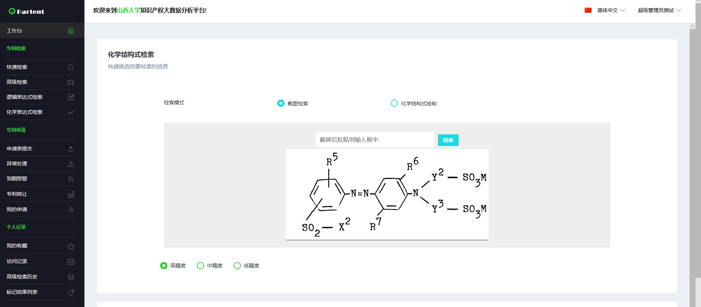

# EDF
Evolutionary Deep Fusion Method for Chemical Structure Recognition


# QuickStart
1. Requirements
   - tensorflow-gpu  2.0.3
   - python 3
2. Data preparation
   
   You can download data from the following url.
   
   |Datasets  |URL |提取码 |
   |----|----|----|
   |ChemBook-10k| https://pan.baidu.com/s/1G1P-_YyDhBTeWXhTeyOaBw  | 4fcj  |
   |ChEMBL-10k  | https://pan.baidu.com/s/1ZcPyJq8C7EEV0Trmc37U8g | 69n3 |
   |PubChem-10k | https://pan.baidu.com/s/1ha8a119gyMul2rzT_aoUlA  | olhr |
   
   Take dataset "ChemBook-10k" for example,
   
   - Download "ChemBook-10k" data set;
   - Put the data set into "ChemBook-10k" folder;
   - Modify paramenter 'data_name'='ChemBook-10k' in config.py file.
  
   The structure of the folder is follows:
  
  |--------------EDF<br/>
      &nbsp;&nbsp;&nbsp;|---ChemBook-10k<br/>
         &nbsp;&nbsp;&nbsp;&nbsp;&nbsp;&nbsp;|---view<br/>
      &nbsp;&nbsp;&nbsp;|---ChEMBL-10k<br/>
         &nbsp;&nbsp;&nbsp;&nbsp;&nbsp;&nbsp;|---view<br/>
      &nbsp;&nbsp;&nbsp;|---PubChem-10k<br/>
         &nbsp;&nbsp;&nbsp;&nbsp;&nbsp;&nbsp;|---view<br/>
   
  
3. Run the following script

    ```python train_EF.py```

Note: Some hyper-parameters can be specified in config.py.


# Experimental results

|Methods  |Top-1 |Top-5 |
|----|----|----|
|Add.| 82.22%| 92.97%|
|Avg.| 82.20%| 91.98%|
|Max.| 80.31%| 91.67%|
|Mul.| 81.03%| 92.13%|
|Con.| 80.46%| 90.07%|
|MLB | 80.41%| 91.94%|
|MFB | 85.78%| 96.46%|
|TFN | 77.90%| 88.46%|
|EDF (reused=False) | 86.84%| 96.66%|
|EDF (reused=True) | 87.49%| 96.94%|
|EDF (best) | 90.06%| 98.43%|


# Application

With EDF, we develop an image-based patent search subsystem
that has been integrated into the big paten data analysis platform at Shanxi University.
As shown in the following Figure, molecular structure search based on EDF
has been used as one of the four search ways
(other three are quick search, advanced search and logic search).
Different from other three types of search ways based on text query,
EDF based on image query may be more convenient and
efficient for cheminformatics researchers in most cases.
It is worth noting that there is little restriction for query image
such as size, format, resolution,
which brings very good user experience.


